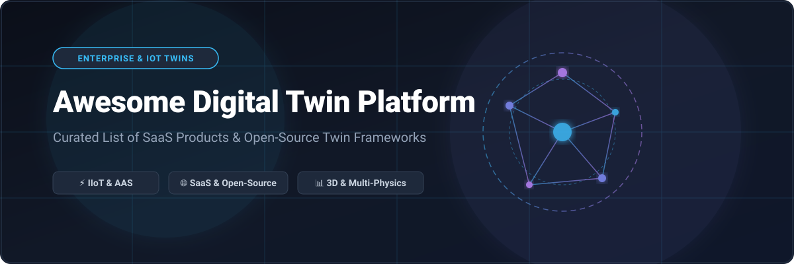
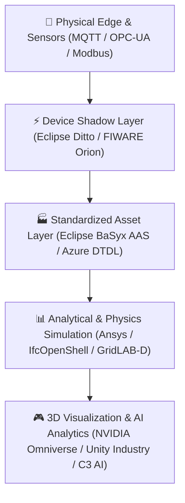

     

# 🌐 Awesome Digital Twin Platform 🚀

> **A comprehensive, curated ecosystem of commercial SaaS platforms, enterprise IIoT frameworks, 3D simulation tools, and open-source Digital Twin technologies.**

---

## 📌 Overview & SEO Summary

**Digital Twin Platforms** create dynamic, real-time virtual representations of physical assets, industrial processes, smart buildings, and complex environments. By fusing **Industrial IoT (IIoT)** telemetry, **Asset Administration Shell (AAS)** data models, **physics-based 3D simulation**, and **predictive AI analytics**, these systems enable enterprise organizations to continuously monitor, simulate, optimize, and automate physical operations.

This repository tracks top commercial SaaS platforms and open-source GitHub projects across the entire Digital Twin architecture stack—from IoT edge device shadowing to multi-physics CAD simulation and enterprise AI graphs.

---

## 📑 Table of Contents

- [☁️ SaaS & Hosted Commercial Digital Twin Platforms](#️-saas--hosted-commercial-digital-twin-platforms)
- [🔓 Open-Source Digital Twin Frameworks & Ecosystem](#-open-source-digital-twin-frameworks--ecosystem)
- [🛠️ Architecture Layers & Integration Stacks](#️-architecture-layers--integration-stacks)
- [🤝 How to Contribute](#-how-to-contribute)
- [🛡️ Security & Operational Disclaimer](#️-security--operational-disclaimer)
- [📈 Star History](#-star-history)
- [💖 Support & Community](#-support--community)

---

## ☁️ SaaS & Hosted Commercial Digital Twin Platforms

**Market Overview**: The global Digital Twin Platform market size is estimated at **$30B – $50B in 2026** and projected to reach over **$300B by 2035** (CAGR of ~35–40%). The sector is **highly fragmented** across industrial IoT, AEC/infrastructure, CAD/PLM simulation, real-time 3D, and enterprise AI, operating as a multi-vendor ecosystem rather than a single winner-take-all market.

| Platform | Company Size (Valuation / Rev) | Starting Tier Price | Free Tier / Trial Limit | Key Description |
| :--- | :--- | :--- | :--- | :--- |
| 🔷 **[Azure Digital Twins](https://azure.microsoft.com/en-us/products/digital-twins)** | ~$3,100B Market Cap ($245B Rev) | $2.50 per 1M operations, $1.00 per 1M messages | 30-day trial with $200 Azure free credits | Enterprise cloud platform for modeling connected environments with DTDL graph topology and live IoT analytics. |
| 🟢 **[NVIDIA Omniverse](https://build.nvidia.com/omniverse)** | ~$3,000B Market Cap ($126B Rev) | Free for individual dev/production ($4,500/yr per GPU for enterprise AI support) | Free for individual creation & production redistribution; 90-day trial for enterprise support | Real-time 3D simulation and virtual world platform for industrial digital twin pipelines and OpenUSD workflows. |
| ⚙️ **[Siemens Xcelerator](https://www.siemens.com/xcelerator)** | ~$140B Market Cap ($84B Rev) | ~$1,200/user/yr (Cloud apps) / ~$250/mo (Insights Hub) | 30-day free software trial; "Start for Free" tier for Insights Hub IoT onboarding | Comprehensive industrial digital twin suite spanning CAD design, factory automation, and IoT asset performance. |
| 📊 **[AVEVA PI System](https://www.aveva.com/en/products/data-hub/)** | ~$130B Market Cap ($40B Rev) | ~$15,000/yr starting pool (AVEVA Flex credit model) | 30-day guided evaluation trial; free academic program for universities | Industrial data historian and context engine powering real-time operational twins across heavy process industries. |
| 🏢 **[Dassault 3DEXPERIENCE](https://www.3ds.com/)** | ~$45B Market Cap ($6.5B Rev) | $99/yr (Makers) / ~$290/mo ($3,480/yr) per user (SOLIDWORKS/CATIA) | 14-day to 30-day free trial for selected cloud roles; free tier for qualified early-stage startups | Engineering-centric PLM and virtual twin platform integrating multi-physics simulation and product lifecycle management. |
| 🧪 **[Ansys Twin Builder](https://www.ansys.com/products/digital-twin/ansys-twin-builder)** | ~$35B Valuation ($2.3B Rev) | ~$4,800/yr per seat starting simulation tier | 30-day expert-guided trial; free student edition for academic coursework | Multi-domain system simulation software for building and deploying physics-based analytical digital twins. |
| 🔌 **[PTC ThingWorx](https://www.ptc.com/en/products/thingworx)** | ~$21B Market Cap ($2.3B Rev) | ~$10,000/yr starting base deployment license | 30-day developer trial (by request) & live interactive sandbox demo | End-to-end industrial IIoT platform for real-time asset monitoring, predictive maintenance, and operational twins. |
| 🏗️ **[Bentley iTwin](https://www.bentley.com/software/itwin-platform/)** | ~$15B Market Cap ($1.3B Rev) | $199/month (Standard Tier, 200 credits/mo; +$1.20/credit) | Free Community Tier (100 credits/mo, 10 GB cloud data, 100 GB reality data free forever for non-commercial use) | Infrastructure digital twin platform for modeling, visualizing, and analyzing civil, building, and GIS asset data. |
| ☁️ **[Altair One](https://www.altair.com/altair-one)** | ~$10.6B Valuation ($650M Rev) | ~$5,000/yr starting pool (Altair Units model) | 15-day free trial on Altair One Marketplace; free Student Edition | Cloud platform for high-performance computing, data analytics, and multi-physics digital twin simulation. |
| 🎮 **[Unity Industry](https://unity.com/solutions/industry)** | ~$8.0B Market Cap ($2.1B Rev) | $4,950/seat/yr ($2,310/seat/yr Unity Pro for <$1M rev) | 30-day free trial for Unity Industry suite; Unity Personal free for <$200k annual revenue | Real-time 3D platform for immersive enterprise digital twins, AR/VR workplace training, and HMI simulation. |
| 🤖 **[C3 AI Platform](https://c3.ai/)** | ~$3.0B Market Cap ($310M Rev) | $0.55 per vCPU-hour ($250,000 for 3-month pilot engagement) | 14-day free trial on Google Cloud Marketplace; 30-day trial for C3 Agentic AI | Enterprise AI software suite for building predictive digital twins, predictive maintenance, and operational AI models. |

---

## 🔓 Open-Source Digital Twin Frameworks & Ecosystem

*Open-source digital twin frameworks provide vendor-neutral standards, device shadowing APIs, Industry 4.0 data models, and domain simulation engines.*

1. 🤖 **[ROS 2 (Robot Operating System)](https://github.com/ros2/ros2)**   
   Open robotics meta-operating system serving as the real-time physical twin layer and runtime execution engine for mobile assets, autonomous robots, and smart logistics.

2. 🏗️ **[IfcOpenShell OpenBIM Stack](https://github.com/IfcOpenShell/IfcOpenShell)**   
   Open-source Industry Foundation Classes (IFC) parsing library and 3D geometry engine powering architectural, building, and infrastructure geometry twins.

3. 🔮 **[Eclipse Ditto](https://github.com/eclipse-ditto/ditto)**   
   Leading open-source API-centric digital twin framework (Eclipse IoT) for state management, asset state synchronization, device shadows, and REST/WebSocket interfaces.

4. 🏙️ **[Bentley iTwin.js Core](https://github.com/iTwin/itwinjs-core)**   
   Open-source TypeScript/JavaScript SDK and web visualization framework for bringing 3D infrastructure digital twins to browsers and mobile applications.

5. 📜 **[Azure DTDL (Digital Twins Definition Language)](https://github.com/Azure/opendigitaltwins-dtdl)**   
   Open language specification and JSON-LD context schemas for defining device capabilities, state telemetry, property graphs, and relationships.

6. 🚜 **[Open-RMF (Robotics Middleware Framework)](https://github.com/open-rmf/rmf)**   
   Interoperability middleware framework coordinating heterogeneous multi-robot fleets, automated facility traffic, and live spatial digital twins.

7. 🌐 **[FIWARE Orion Context Broker](https://github.com/telefonicaid/fiware-orion)**   
   Open NGSI-LD context broker standardizing real-time context management and dynamic data modeling across smart cities, smart agritech, and industrial environments.

8. 🔎 **[Azure Digital Twins Explorer](https://github.com/Azure-Samples/digital-twins-explorer)**   
   Open-source visual developer workbench for graph topology exploration, model creation, and live relationship querying for digital twins.

9. ⚡ **[GridLAB-D Power System Simulator](https://github.com/gridlab-d/gridlab-d)**   
   Advanced power-grid distribution simulation engine providing analytical analytical twin capabilities for smart grids, renewable microgrids, and energy utilities.

10. 🌐 **[Eclipse Thingweb (Web of Things / node-wot)](https://github.com/eclipse-thingweb/node-wot)**   
    W3C Web of Things (WoT) standard implementation enabling interoperable Web APIs, Thing Descriptions (TD), and event interactions for digital twins.

11. 🏭 **[Eclipse BaSyx Python SDK](https://github.com/eclipse-basyx/basyx-python-sdk)**   
    Open Python library implementing Industry 4.0 Asset Administration Shell (AAS) standards for manufacturing submodels and industrial asset compliance.

12. ☕ **[Eclipse BaSyx Java SDK](https://github.com/eclipse-basyx/basyx-java-sdk)**   
    Enterprise Java SDK and runtime server for building Industry 4.0 Asset Administration Shell (AAS) digital representations in smart manufacturing.

---

## 🛠️ Architecture Layers & Integration Stacks

Production-ready digital twin deployments typically integrate multiple specialized software layers:

- **IoT Shadowing**: Eclipse Ditto handles real-time device state synchronization.
- **Standards Layer**: Eclipse BaSyx AAS and DTDL enforce industry-standard metadata models.
- **Spatial & CAD**: IfcOpenShell and iTwin.js manage 3D spatial geometry.
- **Commercial Enterprise**: Azure, Siemens, Ansys, and NVIDIA deliver high-fidelity multi-physics simulation and turnkey scalability.

---

## 🤝 How to Contribute

Contributions are warmly welcome! To submit a new SaaS platform or open-source digital twin tool:

1. 🍴 **Fork the repository**.
2. 📝 **Add/edit entries in `README.md`** (maintaining the existing tabular/list format).
3. 🔗 **Include**: Product name, official link, star badge (if open-source), clear pricing/free tier details, and factual 1–2 sentence description.
4. 📬 **Open a Pull Request (PR)** with a clear explanation of your additions.

Check out our curated list directory: [Awesome-Awesome-Awesome](https://github.com/ishandutta2007/Awesome-Awesome-Awesome).

---

## 🛡️ Security & Operational Disclaimer

- This repository is a **community-curated index** for informational and educational purposes.
- Digital Twin systems frequently integrate with critical physical infrastructure, OT networks, and automation controls. Always execute thorough cybersecurity vulnerability assessments, human-in-the-loop safety reviews, and change management before closing automated control loops.

---

## 📈 Star History

---

## 💖 Support & Community

Thank you for exploring **Awesome Digital Twin Platform**! If you find this curated ecosystem list helpful for your enterprise IoT architecture, research, or development projects, please consider supporting us:

- 🌟 **Star this repository** to help others discover it!
- 🔀 **Fork & Contribute** to submit new open-source projects or SaaS platform updates.
- 📢 **Share with your network** on LinkedIn, Twitter/X, or developer communities.
- ☕ **Sponsor the Project**: [Buy me a coffee on GitHub Sponsors](https://github.com/sponsors/ishandutta2007) to help maintain and grow open developer resources.

---

*Made with ❤️ for IoT architects, industrial automation engineers, BIM specialists, and builders of living virtual systems.*
